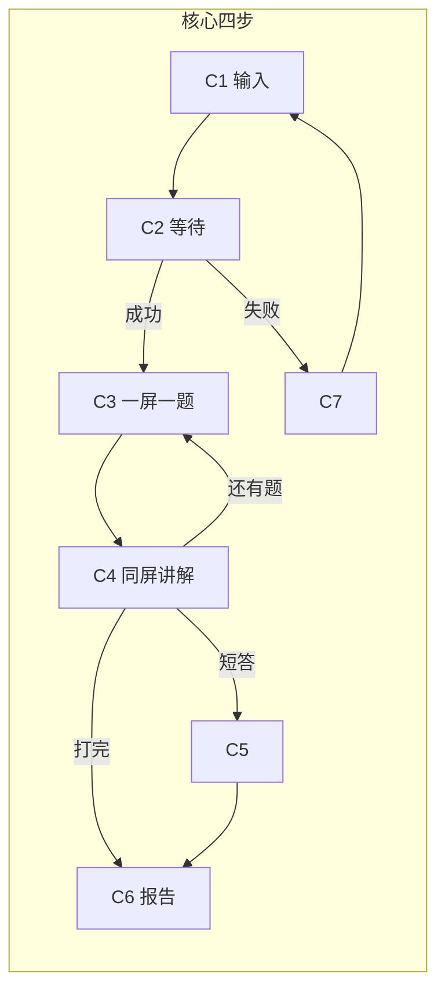

# 关卡学 · UI 设计风格与原型草图

**产品工作名：** 关卡学  
**文档性质：** 人工确认用提案，**不是开发完成**，也不是可交互 HTML 产品。  
**版本：** v1.0  
**撰写日期：** 2026-08-19  
**调研窗口：** 2024–2026 公开站点 / 帮助中心 / 评测 / 品牌页  
**依据：** 《需求分析文档》v1.0、《方案设计文档》v1.2  

> **本轮已锁定，不再让人选风格强度或外壳。**  
> 1. **UI 强度：作业本 / 草稿本。** 米黄纸、手绘粗线、胶带与涂改痕迹；排版仍清楚，保证约 8 分钟能答完。不要漫画分镜占画面，不要故意丑到难读。禁止阿衰人物形象、书名 logo、面板分镜原画。  
> 2. **外壳：微信小程序壳。** 顶栏 + 右上角胶囊按钮，画成真机截图；内容区按 H5 / 小程序页排。第一期没有登录、VIP、PK、底部「我的」Tab。

---

## 0. 读这份提案时请记住的三件事

1. **第一期主路径只有四步：** 粘贴文本 → 出题等待 → 一屏一题（对错 + 讲解 + 原句）→ 通关报告。不要发明登录墙、会员墙、实时 PK 当首页。  
2. **确认之后**才允许做「一行三列 HTML 草图文件」；本文件只写风格、线框、拆分计划。  
3. **意境来自《漫画阿衰》（猫小乐）的学校日常与作业本气质，不是 IP 授权。** 抄气质，不抄角色。

---

## 1. 竞品视觉调研结论

调研方法：Web 检索 + 官方页抓取（含 Firecrawl branding）+ 帮助中心 / 评测。颜色以能核对的官方或站点实测为准；未能从官方品牌手册拿到的 hex 会标明 **【观感归纳，非官方手册】**。

### 1.1 国际：内容变测验 / 闪卡

#### Quizlet

| 项 | 观察 |
| --- | --- |
| 主色 | 电光靛 `#4255FF`；画布白 / 浅灰 `#F6F7FB`；字色炭蓝 `#282E3E`；黄 `#FFCD1F`、珊瑚 `#FF725B` 作点缀 |
| 字体气质 | Hurme Geometric Sans：几何、备考、学习小组学霸，不土、不手写 |
| 卡片 / 关卡 | 翻转闪卡是品牌母题；圆角 8–16px，淡紫投影；Learn / Test / Match 多模式并列 |
| 答题反馈 | 对错即时；正确路径偏「掌握这张卡」，错了再进队列；偏应试打卡 |
| 报告 / 分享 | 进度、掌握度、套题链接；分享物是「卡组」不是「刚搞懂一篇文章」 |
| 可借鉴 | 一题一屏、选项够大、反馈不打断 8 分钟节奏 |
| 必须避开 | 紫蓝 EdTech 脸、广场卡组、学习模式矩阵；那是备考操作系统 |

来源： [Quizlet](https://quizlet.com/) · [Duply DESIGN.md](https://duply.ai/quizlet/design-md) · [Refero 设计系统](https://styles.refero.design/style/528eb1d4-8508-4dc6-87b4-c7b92d648dac) · [webdesignhot](https://www.webdesignhot.com/design.md/quizlet/)

#### Knowt

| 项 | 观察 |
| --- | --- |
| 主色 | 品牌青绿 `theme-color: #50D2C2`；辅色浅紫 `#C89EFD`；底 `#F7F8FA`；深青绿字 `#15504A` |
| 字体气质 | bwModellica 等圆几何；学生 App，玩、亮、玻璃拟态（2026 Liquid Glass 更新） |
| 卡片 / 关卡 | PDF / 视频一键成卡；Learn / Practice Test / Match；龙形象 Kai 当吉祥物 |
| 答题反馈 | 应试练习即时判分；广告会打断免费档（评测指出 Android 中段插广告） |
| 报告 / 分享 | 掌握度、AP 进度、streak / badge；心智是「考前工具」 |
| 可借鉴 | 导入即练的短路径；闪卡点击热区大 |
| 必须避开 | 吉祥物人格、玻璃拟态、streak、广告插在答题中；以及紫青「Gen-Z 学习 App」通用脸 |

来源： [Knowt](https://knowt.com/) · [App Store 更新说明](https://apps.apple.com/jm/app/knowt-ai-flashcards-notes/id6463744184) · [ProdApps 评测](https://productivity-apps.com/apps/knowt) · [Kai 吉祥物](https://whales.design/knowt-brand-mascot/)

#### Gizmo

| 项 | 观察 |
| --- | --- |
| 主色 | 评测写「干净界面 + 品牌紫」**【观感归纳】**；帮助中心字体走 Inter |
| 字体气质 | 现代学生游戏化：清晰、圆、Duolingo 近亲 |
| 卡片 / 关卡 | Magic Import（笔记 / PDF / YouTube）→ 卡组列表；Memorise 模式一问一答 |
| 答题反馈 | 错一题扣 1 颗 Heart（免费 15 颗，耗尽等 10 分钟）；另有 Explain、怪物蛋 / XP / 段位 |
| 报告 / 分享 | streak、联盟、商店金币；社交是好友与 Live 竞赛 |
| 可借鉴 | 「导入材料立刻开练」；卡住时有一句讲解入口 |
| 必须避开 | **Hearts、体力、签到、段位、商店。** 需求分析已写死：泛知识用户会被当成打卡 App 而走 |

来源： [How do I use Gizmo?](https://help.gizmo.ai/en/articles/13011434-how-do-i-use-gizmo) · [What are Hearts?](https://help.gizmo.ai/en/articles/15623061-what-are-hearts) · [Techpoint 评测](https://techpoint.africa/guide/gizmo-ai-review/) · [ScreensDesign](https://screensdesign.com/showcase/gizmo-ai-flashcards)

#### Quizgecko

| 项 | 观察 |
| --- | --- |
| 主色 | 近黑墨水 `#020617` + 白底；链接/点缀奶油纸色 `#FCF5E3`；标题衬线 Merriweather，正文 Satoshi |
| 字体气质 | 2025–2026 独立 SaaS：深色 CTA、课程仪表盘；比 Quizlet 更「工具站」 |
| 卡片 / 关卡 | 上传 → 整包 Course（测验 + 闪卡 + 笔记 + 播客）；可换主题色 |
| 答题反馈 | 实时判分、弱项检测、考试计时模式 |
| 报告 / 分享 | 课程链接、LMS 导出、小队周榜；传播物是「课程」不是「一篇刚看完的文章」 |
| 可借鉴 | **输入 → 完整可打完的练习包** 这条窄路径；报告结构固定 |
| 必须避开 | 学期订阅叙事、进度仪表盘、播客课、排行榜；那会把关卡学做成应试 LMS |

来源： [Quizgecko](https://quizgecko.com/) · [Help: getting started](https://help.quizgecko.com/en/articles/7936042-getting-started-with-quizgecko-making-quizzes-flashcards-more) · [App Store](https://apps.apple.com/gb/app/quizgecko-ai-flashcards/id6473546188)

#### Anki（移动端）

| 项 | 观察 |
| --- | --- |
| 主色 | 几乎无品牌色；浅色白卡，深色常见 `#303030` 一类灰底 |
| 字体气质 | 工具、可主题化、反设计；用户自己写 CSS |
| 卡片 / 关卡 | 一张卡正反面；底栏 Again / Hard / Good / Easy |
| 答题反馈 | 间隔重复调度，不是「对错讲解 + 原句」 |
| 报告 / 分享 | 卡组文件；没有通关社交物 |
| 可借鉴 | 一屏只做一件事；干扰为零 |
| 必须避开 | Anki 化首页、复习队列、四键调度；需求明确：不要做成第二个 Anki |

来源： [Anki](https://apps.ankiweb.net/) · [AnkiMobile night mode](https://docs.ankimobile.net/night-mode.html) · [AnkiDroid 新学习屏讨论](https://forums.ankiweb.net/t/new-study-screen-official-thread/67394)

### 1.2 国内：助手 / 讲解课 / 阅读 / 听记

#### 豆包

| 项 | 观察 |
| --- | --- |
| 主色 | 对话产品：白底、黑白主结构；用户气泡偏蓝，助手灰气泡**【观感归纳】**；图标常见蓝白对话气泡 |
| 字体气质 | 国民助手：圆润、无衬线、表情缓和严肃感 |
| 卡片 / 关卡 | **没有关卡对象。** 出题是用户自己下指令；豆包爱学 / 豆包课堂是「讲课 + 小测」，主路径仍是对话或视频课 |
| 答题反馈 | 讲题步骤、可追问；讲完不一定留下可分享的通关物 |
| 报告 / 分享 | 聊天记录；不是通关卡 |
| 可借鉴 | 首页任务极短：「把这段变成关」应像发一条消息那么轻 |
| 必须避开 | 做成「另一个聊天窗」；任何演示若只是出题，用户会问为什么不用豆包 |

来源： [产品体验报告-豆包](https://news.qq.com/rain/a/20240823A05V0L00) · [豆包强化讲解 vs 练习（36氪）](https://36kr.com/p/3739607815602176) · [豆包课堂](https://news.qq.com/rain/a/20260527A03AH800)

#### Kimi

| 项 | 观察 |
| --- | --- |
| 主色 | 官方品牌手册写「**核心品牌蓝**」；浅色「月之亮面」暖白，深色「月之暗面」；电光蓝高亮 |
| 字体气质 | 科学人文、长文研究、像和熟人说话；不是作业本 |
| 卡片 / 关卡 | 无；出题依赖用户会写提示词 |
| 答题反馈 | 对话气泡 |
| 报告 / 分享 | 会话分享，不是通关证明 |
| 可借鉴 | 等待时给过程感，但不要装进度条到 99% |
| 必须避开 | 灰蓝研究风、玻璃质感、把关卡学做成深度研究 |

来源： [Kimi 品牌手册](https://www.kimi.com/zh-hans/resources/kimi-brand) · [优设：月之亮面](https://www.uisdc.com/hunter/0221563891.html)

#### 秘塔「今天学点啥」

| 项 | 观察 |
| --- | --- |
| 主色 | 秘塔站偏青绿搜索风**【观感归纳】**；学习模块强调无广告、轻界面 |
| 字体气质 | 讲解课 / 虚拟老师；风格选项从「课堂」到「暴躁老哥」，表演感强 |
| 卡片 / 关卡 | 文档/网址 → PPT 视频课；课后「考考我」才是题；另有好友 PK、书架 |
| 答题反馈 | 答错给解析；成就奖励 |
| 报告 / 分享 | 课程链接、PK；传播物是「一节课」 |
| 可借鉴 | 国内链接进学习流；课后题有解析 |
| 必须避开 | **不要比谁更能把文章讲成课。** 数字人、20 种音色、鼓掌送花、PK 主路径。关卡学的主界面必须是答题，讲解为答题服务 |

来源： [入口 metaso.cn/study](https://metaso.cn/study) · [多知 2025-04-21](https://news.qq.com/rain/a/20250421A062H400) · [掘金实测](https://juejin.cn/post/7496522741941829666) · [App Store](https://apps.apple.com/cn/app/%E4%BB%8A%E4%BB%A9%E5%AD%A6%E7%82%B9%E5%95%A5/id6744347210)

#### 夸克学习

| 项 | 观察 |
| --- | --- |
| 主色 | 阿里系搜索青/相机入口；「夸克老师」数字人居中**【观感归纳】** |
| 字体气质 | AI 家教、黑板推导、拍题 |
| 卡片 / 关卡 | 拍题 / 作业批改 / 变式出题；电子白板讲题 |
| 答题反馈 | 分步推导 + 错题归因 + 再出变式 |
| 报告 / 分享 | 错题本、试卷下载；应试闭环 |
| 可借鉴 | 讲错时「你可能这么想」再指回依据 |
| 必须避开 | 拍题、数字人老师、K12 家教脸；关卡学必须离作业帮战场远一点 |

来源： [夸克老师](https://news.qq.com/rain/a/20250624A028D900) · [AI 解题大师](https://www.jiemodui.com/N/138708.html)

#### 得到

| 项 | 观察 |
| --- | --- |
| 主色 | 知识服务红/暖色 + 阅读沉浸**【观感归纳】**；文稿默认「得到今楷」 |
| 字体气质 | 专栏、听书、终身学习者身份 |
| 卡片 / 关卡 | 课程表、划线笔记；「得到大脑」偏创作 Agent，不是任意网页变关 |
| 答题反馈 | 非本产品主路径 |
| 报告 / 分享 | 学习数据按日/周/月；知识城邦 |
| 可借鉴 | 报告语气像「我刚搞懂」，不像奖状 |
| 必须避开 | 课程商城、学时竞赛、知识身份包装 |

来源： [得到大脑体验](https://blackstones.xyz/dedao-brain-knowledge-creation-tool/) · 得到 App 更新说明转述（今楷、学习数据）

#### 微信读书 · 问书 / 相邻「闪测」

| 项 | 观察 |
| --- | --- |
| 主色 | 微信绿生态内的阅读绿/白**【观感归纳】** |
| 字体气质 | 阅读器：选中即问，浮层解释概念 |
| 卡片 / 关卡 | **问书解决「这段什么意思」，不解决「我能不能讲出来」。** 幕布「AI 闪测」才是大纲变选择/简答，且自定位为轻量复习插件 |
| 答题反馈 | 问书给引用片段；闪测是笔记插件 |
| 报告 / 分享 | 弱；不是通关卡 |
| 可借鉴 | **每句能指回原文**；浮层不要盖住整页材料 |
| 必须避开 | 做成阅读器聊天；不要把闪测当笔记软件的附属按钮——关卡学要独立结果物 |

来源： [学习骇客：问书与闪测](https://xxhk.org/p0k2jt) · [人人都是产品经理：问书](https://www.woshipm.com/evaluating/6067639.html) · [SegmentFault 问书体验](https://segmentfault.com/a/1190000046302004)

#### 通义听悟

| 项 | 观察 |
| --- | --- |
| 主色 | 阿里云工作台：白、记录列表、章节卡片**【观感归纳】** |
| 字体气质 | 会议纪要 / 课堂记录：左转写、右摘取 |
| 卡片 / 关卡 | 无测验主路径；停在摘要、章节、待办 |
| 答题反馈 | 无 |
| 报告 / 分享 | 分享记录邀请注册 |
| 可借鉴 | 原文可定位（时间戳思维）；失败就失败，不脑补 |
| 必须避开 | 重做转写产品；听悟是上游，关卡学接「文稿之后」 |

来源： [tingwu.aliyun.com](https://tingwu.aliyun.com/) · [功能规格](https://help.aliyun.com/zh/tingwu/features) · [评测](https://www.woshipm.com/evaluating/5891746.html)

### 1.3 横向结论（给关卡学的视觉决策）

2024–2026 这批产品在视觉上高度同质：**白底 + 一颗饱和品牌色（靛 / 青 / 紫）+ 大圆角卡片 + 几何无衬线。** 国内助手是对话框，秘塔是讲课舞台，国际是闪卡操作系统。

关卡学要让人在微信里一眼看出「这不是豆包，也不是 Quizlet」，靠的不是再选一颗紫，而是：

- **物件感：** 一份刚写完的练习纸，不是 SaaS 仪表盘。  
- **结束感：** 通关报告像能转发给朋友的作业批改页，不是成就奖杯。  
- **信任感：** 原句像用红笔/胶带贴在题旁边的摘抄，不是脚注链接堆。

---

## 2. 「阿衰意境」设计语言（作业本清晰 · 已锁定）

### 2.1 从漫画里提炼什么、绝不碰什么

《阿衰 on line》（猫小乐）是校园幽默漫画：怕踢中学、作业、考试、土味点子、略乱但有人味。百科对画风的归纳是：造型洗练、线条干净明快并有粗细节奏，**不是日系精致美少年，也不是无脸矢量插画。**

**提炼（用于 UI，不是临摹）：**

- 学校作业本 / 草稿本：米黄纸、格子或横线、订口、页码  
- 手绘粗线框，略微歪，但不歪到对不齐选项  
- 涂改：修正带、叉掉的错字、红笔批改  
- 胶带、订书钉、便利贴——用来标「原句」「已掌握」  
- 土味幽默在**文案语气**（「这题出歪了」「这几个点值得再看一眼」），不在角色表情包  
- 略乱：纸纹、一滴墨、一角折痕；乱在装饰层，不乱在信息层  

**严禁：**

- 阿衰蘑菇头、黄帽衫、大脸妹、金乘五等任何可识别人物  
- 《阿衰》书名手绘 logo、杂志封面构图、分镜原画  
- 把整屏切成四格漫画（用户已否决「分镜占画面」）  
- 纯黑白到选项看不清  
- Tailwind 紫渐变、玻璃拟态、Inter / Roboto 当主字体、SaaS 仪表盘  

来源（意境，非视觉抄袭）： [维基：阿衰 on line](https://zh.wikipedia.org/wiki/%E9%98%BF%E8%A1%B0on_line) · [百度百科：猫小乐](https://baike.baidu.com/item/%E7%8C%AB%E5%B0%8F%E4%B9%90/3072450)

### 2.2 色彩（具体 hex）

纸面要够亮，字要够深，对错要一眼能分。对比度按正文 ≥ 4.5:1 来守。

| Token | Hex | 用途 |
| --- | --- | --- |
| `paper` | `#F3E6C9` | 页面底：作业本米黄 |
| `paper-deep` | `#E8D4A4` | 订口阴影、页边 |
| `line` | `#D4C19A` | 横线 / 浅格，不抢字 |
| `ink` | `#2A2418` | 题干、选项正文（禁止 `#000` 死黑铺满） |
| `ink-soft` | `#5C5346` | 次要说明、AI 标识 |
| `pen-red` | `#C44536` | 批改红：错、圈、下划重点 |
| `pen-blue` | `#2F5D8A` | 圆珠笔蓝：选中框、进度「第 3/7 题」 |
| `stamp-green` | `#2F6B4F` | 对勾戳、「已掌握」 |
| `tape` | `#E7C97A` | 半透明胶带条，贴原句 |
| `whiteout` | `#F7F1E3` | 涂改液块、输入区 |
| `cta` | `#C44536` | 主按钮「生成关卡 / 下一题」——红笔，不是品牌紫 |
| `cta-ink` | `#F3E6C9` | 主按钮上的字 |
| `disabled` | `#B8A88A` | 未选选项描边 |
| `danger-bg` | `#F3D2C8` | 错题讲解底（浅，不刺眼） |
| `ok-bg` | `#D5E5D6` | 对题讲解底 |
| `capsule` | 微信原生 | 顶栏胶囊不改形，只用深色方案配米黄纸 |

**不用的色：** `#4255FF`、`#7C3AED`、紫粉渐变、纯霓虹绿对勾。

### 2.3 字体策略

小程序 / H5 都要考虑中文可读和 8 分钟答题。

| 角色 | 策略 | 候选（确认后开发再落包） |
| --- | --- | --- |
| 品牌词 / 页标题 | 有手写气但能认 | **霞鹜文楷** 或 **LXGW WenKai**；字号 20–22pt，字重 Regular，不要花体 |
| 题干、选项、按钮 | **清楚第一** | 系统黑体栈：`PingFang SC` / `HarmonyOS Sans` / `Noto Sans SC`；选项 16–17pt，行高 1.45 |
| 讲解、原句、报告金句 | 略稿纸 | 文楷 15pt；原句可再小一号但对比足够 |
| 英数 / 进度 | 等宽一点更好玩 | `IBM Plex Mono` 或系统等宽，仅用于「3/7」「8 min」 |

禁止把 Inter、Roboto、Arial 当中文主字体。英文品牌词「关卡学」若出现在顶栏，用文楷即可。

### 2.4 线宽、纸张、装饰剂量

- **线：** 选项框、主按钮 2.5–3.5px 深褐描边，允许 1px 内的不规则（CSS 可用轻微 `filter` 或 SVG 边，不要抖到文字跟着抖）。  
- **圆角：** 4–8px，像裁切的纸角，不要 999px 胶囊按钮（微信胶囊除外）。  
- **纹理：** 5–8% 的纸噪点；横线间距约 28px，只出现在背景，文字不要骑在线上对不齐。  
- **胶带 / 涂改：** 每屏最多 1–2 处。原句一条胶带；错题一个红叉。不要满屏贴纸。  
- **阴影：** 几乎不用投影；用错位 2px 的第二层描边模拟「垫了一张纸」。

### 2.5 组件怎么长

**按钮**

- 主按钮：红笔填充 + 粗线框 + 文楷/黑体「生成关卡」。按下时像盖了个章（轻微压下，不要闪光）。  
- 次按钮：白涂改液底 + 墨线，「取消」「复制报告」。  
- 选项按钮：整行可点，高度 ≥ 48px（约 9mm），左字母 A–D 像答题卡。

**卡片**

- 不是浮动白卡片。是**纸上的一块题区**：上边一条圆珠笔进度，中间题干，下面四个选项。  
- 讲解展开后，像老师在题下用红笔写了三行，再贴一条原句胶带。

**对错反馈**

- **对：** 选项左侧盖绿戳「答对了」；讲解浅绿地；不放礼花、不放 XP。  
- **错：** 所选选项红叉 + 划掉；正确答案蓝笔圈出；讲解先一句「你可能把 A 和 B 搅在一起了」，再指原句。  
- **短答：** 不打百分制；用「可能盖到了这些点」清单，语气同需求文档：不羞辱。  
- 对的也要讲（防蒙对）。底部始终有「这题出得不准」。

**顶栏（小程序壳，见第 3 节）**

- 返回 + 居中标题「关卡学」或「第 3 题」。  
- 右侧必须留出胶囊区，**任何按钮不得贴着胶囊。**

### 2.6 禁用项清单（开发时当 lint）

1. 任何阿衰 / 漫画派对可识别形象、书名、分镜原画  
2. 满屏四格漫画、对话框尾占用超过 15% 高度  
3. 紫渐变、玻璃拟态、3D 奖杯、Confetti 连爆  
4. 体力心、签到日历、排行榜、VIP 金标（第一期页面上不出现）  
5. 纯黑背景 + 白字「酷炫暗黑学习」  
6. 选项字号 < 15pt、点击热区 < 44px  
7. 把 AI 标识藏起来（必须可见：「题目与解析由 AI 根据你提供的材料生成」）

---

## 3. 主推荐方向（已写死）

**一句话：** 微信小程序壳里的一份能读完的作业本——米黄纸、红笔批改、胶带贴原句；一屏一题，八分钟打完，报告像批改过的通关纸。

### 3.1 外壳规格（像真机截图）

按[微信小程序设计指南](https://developers.weixin.qq.com/miniprogram/design/index.html)：

- 画板宽度 **375px**（指南 6.1 基准），高度按 iPhone 安全区示意（含底部 Home Indicator）。  
- **状态栏**（时间、电量）+ **导航栏**（返回、标题）+ **右上角胶囊**（「…」| 圆形）。胶囊不可自定义内容，本提案用**深色胶囊**配米黄纸。  
- 导航栏标题色用 `ink`；返回箭头与标题不要做成漫画气泡。  
- **第一期无底部 Tab。** 指南允许首页原生 Tab，但登录/我的/VIP 都不是第一期主路径，画了会误导确认。  
- 左缘可右滑返回：线框里用小字标「手势：右滑返回（系统）」。  
- 内容从导航栏下开始，**永远给胶囊留出约 87pt 宽的右上空白。**

### 3.2 两个备选强度（本轮否决，只作边界对照）

确认后开发**不走**这两条，写在这里是为了防止以后把风格「加强」过头：

| 强度 | 长什么样 | 为何否决 |
| --- | --- | --- |
| 分镜更漫画 | 四格框、速度线、拟声词、角色剪影 | 占画面，拖慢 8 分钟答题；且易滑向抄袭分镜 |
| 更丑帅 | 歪字、墨团、低对比涂鸦、难读手写体铺选项 | 故意丑到难读，完成率会掉 |

---

## 4. 完整页面清单

对齐需求 P0/P1 与方案步骤 1 / 3 / 4 / 5。第一期没有的页面标「扩展套」，确认 HTML 时不要画进核心三列的主路径。

### 4.1 核心业务流程一套（第一期必须能走完）

| # | 页面 | 对应方案 | 用户看见 | 第一期没有 |
| --- | --- | --- | --- | --- |
| C1 | 输入 | 步骤 1 | 可选标题 + 大文本框 + 「生成关卡」；过短拦截 | 链接/文件 Tab 不当默认 |
| C2 | 等待 | 6.4 阶段文案 | 阶段字 + 已等待秒数 + 取消；提示留在此页 | 假进度条到 99%、流式第 1 题 |
| C3 | 答题（选择） | 一屏一题 | 进度、题干、A–D、提交 | 匹配/拖拽/听力 |
| C4 | 讲解（同屏展开） | 对错+讲解+原句 | 戳记、讲解、胶带原句、不准反馈、下一题 | 每题再调模型的等待 |
| C5 | 答题（短答） | 1 道用自己的话 | 多行输入、对照要点弱提示 | 百分制打分 |
| C6 | 通关报告 | 8.5 固定结构 | 标题、一句话、已掌握、仍含糊、金句、复制、再打一套 | 精装海报工坊、排行榜 |
| C7 | 失败 / 空态 | 6.3 | 太短、出题失败可重试、模型忙、超时缩短材料 | 用标题脑补一套题 |

### 4.2 扩展功能一套（以后「第二份 HTML」）

| # | 页面 | 需求 | 草图策略 |
| --- | --- | --- | --- |
| E1 | 链接 / 文档输入 | U1、U10；方案步骤 3 | **要草图** |
| E2 | 解析失败引导改贴文本 | 失败路径 | 列清单即可，可复用 C7 语气 |
| E3 | 主题检索 → 来源清单确认 | U3 | **要草图**（来源可见才能出题） |
| E4 | 多视角题 | U9 | **要草图**（选项气质不同） |
| E5 | 学习记录列表 | U7 | **要草图**（极简，不要雷达图） |
| E6 | 错题再打 / 原题再打 | 支线 C | 清单 |
| E7 | 分享报告落地（好友开打同一关） | U6；步骤 4 | **要草图** |
| E8 | 弱异步对比「我的结果 vs 出题者」 | 后期弱 PK | 清单，不当第一期 |
| E9 | 通关末可选苏格拉底追问 | P1 薄做 | 清单 |
| E10 | 小程序说明 / AI 标识页 | 审核 | 清单 |
| — | 登录 / VIP / 实时 PK / 数字人 / 排行榜 | P2 | **不画** |

---

## 5. 低保真草图

约定：每个手机框 = 微信壳。`[胶囊]` 在右上。手势写在框外。文案是占位，可在确认后改口吻，但结构不要改。

### 5.0 壳（所有页共用）

```
┌──────────────────────────────┐
│ 9:41                     ▓▓  │  ← 系统状态栏
│ ◀  关卡学          [ ··· | ○] │  ← 导航 + 胶囊（勿遮挡）
├──────────────────────────────┤
│                              │
│         内容区 375 宽         │
│                              │
├──────────────────────────────┤
│           ─ ─ ─              │  ← Home Indicator（示意）
└──────────────────────────────┘
手势：边缘右滑 = 系统返回。答题页不要自定义左滑切题（防误触提交）。
```

### 5.1 C1 输入

```
┌──────────────────────────────┐
│ 9:41                     ▓▓  │
│     关卡学            [胶囊] │  ← 首页无返回，或返回微信
├──────────────────────────────┤
│  [纸纹]                      │
│  把刚看完的，变成一关         │  ← 文楷标题
│  约 8 分钟打完。不是考试。    │
│                              │
│  标题（可选）                 │
│  ┌────────────────────────┐  │
│  │ 例：行为经济学为什么反直觉│  │
│  └────────────────────────┘  │
│                              │
│  材料（必填）                 │
│  ┌────────────────────────┐  │
│  │ 在这儿粘贴正文……        │  │  ← 涂改液块 + 横线底
│  │                        │  │
│  │                        │  │
│  │              0 / 建议≥200│  │
│  └────────────────────────┘  │
│                              │
│  [ 生成关卡 · 约 6–8 题 ]    │  ← 红笔主按钮
│                              │
│  题目由 AI 根据你贴的材料生成 │
│  第一期只支持粘贴文本         │  ← 诚实，不画假的「链接」主 Tab
└──────────────────────────────┘
手势：长按粘贴。空/过短点生成 → 原位报错，不跳走。
```

过短拦截文案占位：「材料太短，出题会空洞。再贴一段正文。」

### 5.2 C2 等待

```
┌──────────────────────────────┐
│ 9:41                     ▓▓  │
│ ◀  正在出题           [胶囊] │
├──────────────────────────────┤
│                              │
│      ┌ 一页正在写的稿纸 ┐    │
│      │  铅笔小动画（循环）│    │  ← 简洁，不要三个点 SaaS spinner
│      └──────────────────┘    │
│                              │
│  正在阅读材料                 │  ← 0–5s
│  （5s 后换成：正在出概念辨析   │
│   题和干扰项）                │
│  （20s 后：仍在生成，长文会   │
│   多等一会儿）                │
│                              │
│  已等待 00:12                 │  ← 等宽数字，不是假百分比
│                              │
│  请留在这一页。切走可能中断。  │
│                              │
│  [ 取消本次 ]                 │
│  题目由 AI 生成，会消耗额度    │
└──────────────────────────────┘
手势：取消 = 丢弃请求，回到输入且文本还在。禁止后台偷偷出题成功。
```

### 5.3 C3 + C4 答题（选择）与讲解

**提交前：**

```
┌──────────────────────────────┐
│ 9:41                     ▓▓  │
│ ◀  第 3 / 7 题        [胶囊] │
├──────────────────────────────┤
│  圆珠笔：████░░░  约 8 分钟   │
│  来源：《标题摘字》            │
│                              │
│  本题只打一个点：损失厌恶      │  ← 小字，ink-soft
│                              │
│  题干题干题干题干题干？        │
│                              │
│  ┌─ A ─────────────────────┐ │
│  │ 选项……                  │ │  ← 整行热区
│  └─────────────────────────┘ │
│  ┌─ B ─────────────────────┐ │
│  │ 选项……   ← 点选后蓝笔描边 │ │
│  └─────────────────────────┘ │
│  ┌─ C ─────────────────────┐ │
│  │ 选项……                  │ │
│  └─────────────────────────┘ │
│  ┌─ D ─────────────────────┐ │
│  │ 选项……                  │ │
│  └─────────────────────────┘ │
│                              │
│  [ 就选这个 ]                 │  ← 未选时 disabled
│  题目由 AI 根据材料生成        │
└──────────────────────────────┘
手势：点选项 = 选中；点主按钮才提交。不要点一下就跳走。
```

**提交后（同屏展开，不新开路由）：**

```
┌──────────────────────────────┐
│ ◀  第 3 / 7 题        [胶囊] │
├──────────────────────────────┤
│  （题干收成两行，仍可回看）    │
│  A  划掉 + 红叉  你刚选的      │
│  B  蓝圈  正确                 │
│  C / D  变淡                   │
│                              │
│  ┌ 浅粉底 · 红笔 ─────────┐  │
│  │ 没答对。你可能把「确定损失│  │
│  │ 」听成了「风险更大」。    │  │
│  │ 对的也要讲：B 说的是……  │  │
│  └────────────────────────┘  │
│  ┌ 胶带贴条 原句 · 第 3 段 ┐  │
│  │ 「……不超过约 40 字……」 │  │
│  └────────────────────────┘  │
│                              │
│  这题出得不准                  │  ← 文本链，不跳问卷系统
│  [ 下一题 ]                   │
└──────────────────────────────┘
手势：讲解区可竖滑；主按钮始终在底，避免找不到下一题。
```

对的时候：绿戳「答对了」+ `ok-bg`，结构相同。

### 5.4 C5 短答

```
┌──────────────────────────────┐
│ ◀  第 7 / 7 题        [胶囊] │
├──────────────────────────────┤
│  用自己的话说明：……           │
│  ┌────────────────────────┐  │
│  │                         │  │
│  │  （多行，像作文格）      │  │
│  └────────────────────────┘  │
│  不打分。写完对照要点。        │
│  [ 写完了 ]                   │
│           ↓ 提交后            │
│  可能盖到了：要点1 ✓  要点2 ○ │
│  参考说法（不是标准答案）      │
│  胶带原句                     │
│  [ 看通关报告 ]               │
└──────────────────────────────┘
```

### 5.5 C6 通关报告

```
┌──────────────────────────────┐
│ 9:41                     ▓▓  │
│     通关纸            [胶囊] │  ← 无返回也可，用「再打一套」走
├──────────────────────────────┤
│  我刚刚搞懂了《来源标题》      │
│  ────────────────────        │
│  一句话总评（可转述，不鸡汤）  │
│                              │
│  已掌握                       │
│  • 要点  • 要点  • 要点       │  ← 绿戳或加粗
│                              │
│  仍含糊（来自错题）            │
│  • 点  • 点                   │  ← 红笔圈，语气：再看一眼
│                              │
│  ┌ 胶带金句 ──────────────┐  │
│  │ 原句                    │  │
│  └────────────────────────┘  │
│                              │
│  4 / 6 选择答对了 · 短答另计   │  ← 不是百分制羞辱
│  题目与报告由 AI 生成          │
│                              │
│  [ 复制整页 ]  [ 再打一套 ]   │
│  邀请：用大约 3 分钟打同一关   │  ← 第一期复制；微信分享是扩展
└──────────────────────────────┘
手势：长按复制。再打一套 → 回输入，材料可预填。
```

### 5.6 C7 失败（出题失败示例）

```
┌──────────────────────────────┐
│ ◀  出题           [胶囊]     │
├──────────────────────────────┤
│  这页没写成。                 │
│  模型忙 / 校验没过（原句对不上│
│  材料）。没有用标题瞎编一套题。│
│  [ 重试 ]   [ 回输入改材料 ] │
└──────────────────────────────┘
```

### 5.7 关键页信息架构（总览）



### 5.8 扩展页：重要的才画

**E1 链接 / 文档输入（扩展套，不当第一期首页）**

```
┌──────────────────────────────┐
│ ◀  换一种输入         [胶囊] │
├──────────────────────────────┤
│  纸页签： 文本 | 链接 | 文档  │  ← 文本仍是诚实默认
│  粘贴公众号 / B 站链接        │
│  ┌ https://...            ┐  │
│  └────────────────────────┘  │
│  解析到标题后再生成            │
│  做不到就失败，引导改贴正文    │
└──────────────────────────────┘
```

**E3 主题检索 · 来源确认**

```
┌──────────────────────────────┐
│ ◀  先看将引用的来源    [胶囊] │
├──────────────────────────────┤
│  主题：强化学习在争什么        │
│  ☐ 来源 1 标题 + 站点         │
│  ☐ 来源 2                     │
│  ☐ 来源 3                     │
│  禁止静默用模型记忆出标准答案题│
│  [ 用勾选的来源出关 ]         │
└──────────────────────────────┘
```

**E4 多视角题（选项气质）**

```
题干：材料里各方怎么说「…」？
A  材料主张：…
B  文中提到的反对：…
C  易混的第三种（若文中有）
D  「唯一道德正确答案」← 禁止这样出题
讲解：材料主张 A，常见反对是 B。不是宣布真理。
```

**E5 学习记录（极简列表）**

```
┌──────────────────────────────┐
│ ◀  打过的关           [胶囊] │
├──────────────────────────────┤
│  行为经济学…  昨天  4/6  再打 │
│  合成数据…    3月前  5/7  再打 │
│  不要能力雷达、学时竞赛        │
└──────────────────────────────┘
```

**E7 分享落地（好友打开）**

```
┌──────────────────────────────┐
│     关卡学            [胶囊] │
├──────────────────────────────┤
│  朋友刚搞懂了《标题》          │
│  一句话 + 金句胶带             │
│  [ 用 3 分钟打同一关 ]        │
│  不必先注册。AI 生成已标明。   │
└──────────────────────────────┘
```

**其余扩展（只列，不画）：** E2 解析失败改贴文本；E6 错题再打；E8 异步对比；E9 可选追问；E10 说明页。

---

## 6. 以后 HTML 文件怎么拆（只写计划，本轮不写 HTML）

确认本提案后，再在 `ui-prototype/` 下落静态 HTML。**不要**做成可连后端的产品，**不要**搭 Taro 工程。建议：

| 文件 | 布局 | 里面有什么 | 没有什么 |
| --- | --- | --- | --- |
| `01-core-flow.html` | **一行三列**，每列一部手机壳 | 左 C1 输入；中 C3+C4 答题（可用页内开关切到「提交后讲解」和 C5 短答）；右 C6 报告。页顶用文字链切到「等待 / 失败」叠在中列或整页注释 | 登录、VIP、Tab「我的」 |
| `02-extended.html` | 一行三列或两行 | E1 链接输入、E3 来源确认、E7 分享落地；第二行 E4 多视角、E5 记录 | 实时 PK、数字人 |
| （可选）`03-wait-and-fail.html` | 一行三列 | C2 等待三阶段文案、C7 过短、C7 出题失败 | 若 `01` 已用注释讲清，可省略 |

实现约定（给下一轮，不是本轮）：

- 每列宽度约 375px 手机框，外层横向排列，桌面可滚动。  
- 壳：状态栏 + 标题 + **右侧胶囊示意图**（CSS 画，不调用微信 API）。  
- 纸纹用 CSS 噪点 + 横线，不用生成角色插画。  
- 文案用本文件占位中文。  
- 交互最多「点选项变描边、点提交展开讲解」级别的示意；**禁止**接 FastAPI、禁止完整产品路由。

---

## 7. 明确：这是确认用提案，不是开发完成

- 没有可点击的完整 HTML 站点。  
- 没有 Taro / FastAPI / 业务代码。  
- 视觉 token、线框、页面拆分供你拍板；拍板后才进入「一行三列 HTML 草图」，再往后才是方案文档里的步骤 0–1。  
- 若确认意见是「纸再白一点 / 红笔再少一点」，改的是本文件第 2 节 token，而不是先改代码。

---

## 附录. 竞品来源速查

| 产品 | 可核对链接 |
| --- | --- |
| Quizlet | https://quizlet.com/ |
| Knowt | https://knowt.com/ |
| Gizmo 帮助 | https://help.gizmo.ai/en/articles/13011434-how-do-i-use-gizmo |
| Quizgecko | https://quizgecko.com/ |
| Anki | https://apps.ankiweb.net/ |
| 秘塔学习 | https://metaso.cn/study |
| Kimi 品牌 | https://www.kimi.com/zh-hans/resources/kimi-brand |
| 通义听悟 | https://tingwu.aliyun.com/ |
| 微信小程序设计指南 | https://developers.weixin.qq.com/miniprogram/design/index.html |
| 问书 / 闪测评述 | https://xxhk.org/p0k2jt |

---

**文档结束。** 下一步（需你点头）：按第 6 节写 `01-core-flow.html` / `02-extended.html` 静态线框，仍不搭生产项目。
