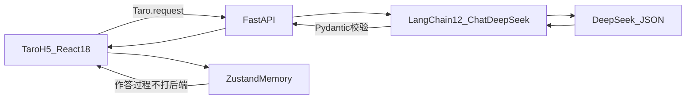
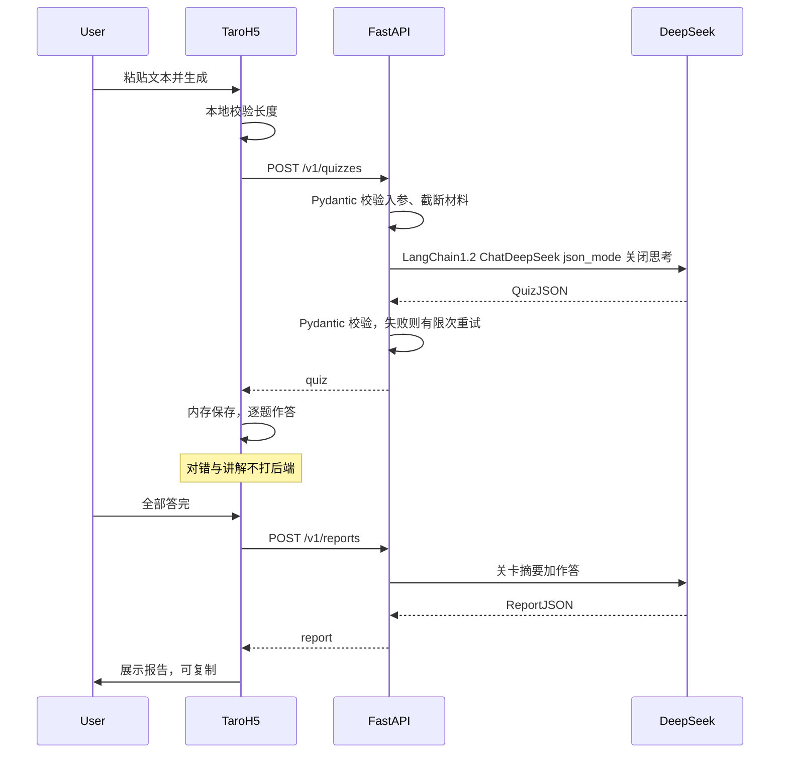

# 方案设计文档

**产品工作名：** 关卡学  
**文档版本：** v1.2  
**撰写日期：** 2026-08-19  
**依据：** [需求分析文档.md](./需求分析文档.md) v1.0  
**决策结论（先看这个）：第一期只做 Web 最小闭环，不上登录、不建数据库。** 前端用 **Taro 4.x + React 18 + TypeScript**，第一期只编译 **H5**，验证「粘贴文本 → DeepSeek 出题 → 答题 → 报告」；后端用 **FastAPI + Python 3.11**，Pydantic v2 约束协议，**LangChain 1.2 + langchain-deepseek** 接入 DeepSeek。题目质量过关后，同一套 Taro 工程再编译微信小程序。小程序运行时不是第一期的验证工具，是第二期的分发工具。

---

## 1. 文档说明与范围

### 1.1 目标读者

本文给独立开发者做「怎么做、先做什么、用什么、明确不用什么」的决策用。读完应能直接开工步骤 1，而不必先选云厂商、先申请小程序类目、先设计用户表。

### 1.2 范围

本文覆盖：设计目标与约束、总体架构、**小程序技术选型对比**、推荐栈、核心业务流程的技术方案、关卡 JSON 与最少接口、DeepSeek 调用设计、分步开发流程、微信移植清单、安全合规、风险与备选。

### 1.3 明确不含

- 产品原型草图、线框图、视觉稿
- 可运行的完整代码、提示词终稿（结构可以写，文案要在实现时按真实题目效果改）
- 人天排期甘特图、人员分工表
- 登录注册、权限模型、云数据库表设计（这些不是第一期）

### 1.4 已确认前提

| 项 | 结论 |
| --- | --- |
| 市场 / 用户 | 国内；泛知识学习者 |
| 第一期客户端 | **先 Taro H5 跑通核心流**，题目质量过关后再编译微信小程序 |
| 模型 | DeepSeek（经 LangChain 1.2 + langchain-deepseek） |
| 技术栈 | Taro 4.x + React 18 + Zustand；FastAPI + Python 3.11 + Pydantic v2 |
| 第一期不做 | 用户登录注册、持久化数据库、VIP、PK、企业知识库 |
| 第一期必须跑通 | 用户输入内容 → AI 生成题目 → 用户答题 → AI 生成分析报告 |

调研日期：2026-08-19。框架版本与模型价格会变动；未能从官方页当面确认的数字标注 **【待核实】**。

---

## 2. 设计目标、约束、与需求对齐

### 2.1 第一期真正要证明的事

需求分析文档的判断是「有条件值得做」。技术方案第一期只服务这个条件里的**产品可实现性**，不服务「做成学习平台」：

1. 指定材料能出一套 6–10 题、5–10 分钟能打完的关。
2. 每题能指回原文片段（对抗「为什么不用豆包」）。
3. 打完有一份通关报告，结构固定，第一期用复制分享即可。

做不到这三条，后续小程序、登录、分享卡片都没有意义。

### 2.2 第一期边界：只覆盖核心四步

| 步骤 | 第一期怎么做 | 明确推迟 |
| --- | --- | --- |
| 输入内容 | **只支持粘贴文本**（可带一个可选标题） | 网页 / 文档 / 视频链接、主题检索、收藏夹导入 |
| AI 生成题目 | 一次请求生成完整关卡 JSON（选择为主，含 1 道短答） | 自适应抽题、多关卡批量生产 |
| 用户答题 | 一屏一题；对错与讲解**用出题时带回的字段**，不必每题再调模型 | 实时 PK、语音播报 |
| AI 生成报告 | 将关卡 + 作答再送一次模型，生成固定结构报告 | 精装海报、PDF、排行榜 |

需求文档 P0 里的「文件上传、网页/视频链接」仍然有效，但它们是**步骤 3 的输入扩展**，不是步骤 1 的开工条件。第一期若同时做解析，独立开发者会在爬虫、反爬、字幕、失败体验上耗尽注意力，核心流反而跑不通。

### 2.3 与需求文档条目的对齐

| 需求 ID | 第一期 | 说明 |
| --- | --- | --- |
| U1 任意形态输入 | 部分 | 文本先行；链接/文件进步骤 3 |
| U2 指定材料出题 | 必须 | 第一期只有指定文本，禁止用模型记忆编题 |
| U4 引导式题目 | 必须 | 选择 + 1 道短答 |
| U5 即时反馈 + 原文 | 必须 | 讲解与 `sourceQuote` 在出题时生成 |
| U6 通关报告 | 必须 | 第一期可复制全文；微信分享进步骤 4 |
| U7 学习记录 | 不做 | 无账号；内存 / 可选 localStorage 草稿不算后台 |
| U8 一次打完 | 必须 | 默认 6–8 题，上限 10 |
| U9 多视角题 | 步骤 5 | 第一期可先对明显观点文降级提示，不强造唯一答案 |
| U10 国内链接一键成关 | 步骤 3–4 | |
| U11–U15 | 更后 | 复习提醒、生图、PK、RAG、VIP |

### 2.4 硬约束

1. **DeepSeek API Key 只存在服务端。** Web 和小程序都不允许直连 `api.deepseek.com`。
2. **第一期无用户系统。** 没有注册、没有 JWT、没有 openid 绑定。刷新页面可以丢掉进度。
3. **第一期无数据库。** 关卡与报告的权威副本在客户端内存；服务端是无状态函数。
4. **Web 验证优先于微信运行时。** 第一期用 Taro 只打 H5，不把日常开发绑在开发者工具、合法域名和审核上。不要第一期就 `dev:weapp` 三端齐开。
5. **生成内容必须可标识为 AI 生成**，并避免大段转载原文。

---

## 3. 总体架构与模块边界

### 3.1 第一期逻辑架构



三块职责：

| 模块 | 做什么 | 不做什么 |
| --- | --- | --- |
| Taro H5（Zustand） | 输入、一屏一题、即时展示对错与讲解、展示报告；页面数据放内存 store | 不持有 Key；不在前端拼模型提示词 |
| FastAPI | HTTP 接口、自动文档、截断材料、把结果变成 Pydantic 模型 | 不存用户；不排队系统；不做爬虫 |
| LangChain 1.2 + ChatDeepSeek | 用 `init_chat_model` 接入 DeepSeek、结构化输出进 Pydantic | 第一期不上 `create_agent`、不上向量库、不上多工具循环 |
| DeepSeek | 按协议产出关卡 / 报告 JSON | 不直接对浏览器 / 小程序暴露 |

答题过程**默认零次模型调用**：正确答案、干扰项逻辑、讲解、原句都在 `QuizJSON` 里。这样 8 道题不会变成 8 次等待，费用也可预期。

报告是第二次模型调用：输入为关卡要点 + 作答对错，输出为需求文档 8.5 的固定结构。短答题的「像不像」不追求精确评分，报告里用要点对照即可。

### 3.2 模块边界（防止第一期膨胀）

```
[输入] → [材料规范化] → [出题] → [关卡协议] → [作答/讲解] → [报告]
              ↑ 第一期只做「文本规范化」
              ↑ 步骤 3 才把链接/文件变成「规范化文本」
```

「材料规范化」的输出永远是：标题 + 纯文本 + 可选分段。出题模块不关心文本从哪来。这是以后接公众号、B 站字幕时唯一该遵守的边界：解析失败就失败，禁止用标题让模型脑补一关。

### 3.3 状态放哪

| 数据 | 第一期 | 步骤 4 微信分享时 |
| --- | --- | --- |
| 当前关卡 JSON | Zustand 内存 | 仍以客户端为主 |
| 作答进度 | Zustand 内存 | 同左 |
| 通关报告 | Zustand 内存 | 同左 |
| 刷新恢复 | 可选 Zustand persist → `localStorage` | 仍不算账号 |
| 好友打开同一关 | 不做 | 才允许**短 TTL、无账号**的关卡缓存（见第 10 节），不是用户表 |

服务端第一期是纯函数：同样的材料不保证返回同一套题（模型有随机性）。若以后要「分享同一关」，必须在步骤 4 把那一份 `QuizJSON` 存下来，而不是让好友再生成一次。

---

## 4. 技术选型对比（小程序为重点）

小程序工具链更新快，这一节按 **2026-08 的官方/主流现状** 写，服务于已经确定的路径：**Web 先验证，再上微信，报告还要能在微信里被打开。** 不是给「哪个框架更流行」打分。

### 4.1 为什么第一期用 Taro，但只打 H5

前端已经选定 **Taro 4.x + React 18**，这样步骤 4 不用换框架。第一期仍然只编译 H5：

| 若第一期这样做 | 实际会发生什么 |
| --- | --- |
| 微信原生 | 题目质量实验被锁在开发者工具里；H5 分享几乎从零重写 |
| Taro 一上来打 weapp | 合法域名、AppID、基础库、预览码会干扰「题好不好」这个唯一问题 |
| **Taro 只打 H5（本方案）** | 同一套页面以后 `build:weapp`；日常用浏览器刷新验证出题 |
| 另起一套 Vite React，步骤 4 再迁 Taro | 多一次重写，和已选栈冲突 |
| uni-app | Vue 体系，和 React 18 不是同一套语法 |

第一期的瓶颈仍是 **DeepSeek 出题质量与关卡协议**，不是列表滚动 FPS。Taro 的价值是「H5 和小程序共用 UI」，不是第一期就要真机预览。

### 4.2 方案对比

| 方案 | 对第一期 Web 验证 | 对第二期微信 | 主要代价 | 本项目结论 |
| --- | --- | --- | --- | --- |
| 微信原生 WXML/WXSS + Skyline / glass-easel | 几乎帮不上 | 性能与新 API 最完整；Skyline 只走 glass-easel | Web 代码基本扔掉 | 关卡学是表单 + 一屏一题，用不上这个天花板 |
| **Taro 4.x + React 18** | `dev:h5` 即可在浏览器打关 | 同一工程 `dev:weapp` | 运行时比原生略重 | **已选定。** 官方文档为 4.x；GitHub 于 2026-07-17 发布 4.2.1 |
| uni-app / uni-app x | Vue 体系 | 多端交付和插件市场强 | 与 React 栈对不上 | 不选 |
| 滴滴 MPX | 对 Web 帮助有限 | 复杂小程序业务性能好 | 生态不如 Taro | 不选 |
| 小程序 `web-view` 嵌已有 H5 | Web 可复用 | 审核、分享、体感都差一截 | 不像「关卡」产品 | **不作为主路径** |
| 微信云开发（云函数 + 云数据库） | 第一期无登录时过重 | 免配域名、有 openid | 长耗时出题易超时；云数据库会破坏「无账号」 | 第一期不用。步骤 4 也不先上云数据库 |
| 微信云托管（容器） | 第一期本地跑 FastAPI 即可 | 同一套 Python API 可迁上去 | 仍要备案与费用 | **步骤 4 可选部署目标** |

补充（渲染层，避免过时选型）：

- Skyline 是微信自研渲染，性能高于 WebView，但 **Skyline 默认强制 glass-easel**，跨端框架对新组件/新 API 的跟进通常滞后于原生。关卡学第一步不要把 Skyline 当成立项前提。
- glass-easel 可在 Web 跑同一套组件，理论上是「官方跨端」。对独立开发者来说文档和生态仍不如 React + Taro 成熟，**不作为第一期或第二期主栈**。
- Taro 3 的运行时方案在高频更新场景损耗更大；本产品答题是低频点击，Taro 4 足够。不要为了 5ms 的 setData 去写原生。

### 4.3 后端放哪：本地 FastAPI vs 云函数 vs 云托管

出题是一次 20–60 秒级的 LLM 调用（材料长时更久），这和「点赞接口」不是同一类后端。

| | 本地 FastAPI（Uvicorn） | 微信云函数 | 微信云托管 |
| --- | --- | --- | --- |
| 第一期 | **最合适**：`uvicorn` 就能打通，自带 OpenAPI 文档 | 要开通环境；Python 云函数超时和冷启动叠加模型等待 | 过早交容器账单 |
| Key 存放 | `.env` 不进 Git | 云函数环境变量 | 容器环境变量 |
| 超时 | 自己设 90–120s | 默认偏短，长文出题容易失败 | 可常驻，适合 LLM |
| 流式 | Starlette/FastAPI SSE，H5 好接 | 云函数不擅长 chunked 长响应 | 可以 |
| 小程序合法域名 | 步骤 4 需要备案 HTTPS | 小程序侧可 `callFunction`，少配一个业务域名 | 可 `callContainer` 或自定义域 |

**结论：** 第一期用本地 FastAPI；步骤 4 把**同一应用**部署到有备案域名的机器，或迁到云托管。不要为了「官方」把出题逻辑拆进云函数。

### 4.4 前端语言：为什么是 React 18 而不是 Vue

已选定 Taro 4 的 React 路径：

- Taro 4 官方主路径是 React；用 React 18 与 Taro 模板常见组合对齐，不必追 React 19。
- 状态用 Zustand，足够覆盖「当前关卡 / 当前题号 / 作答 / 报告」四个切片，不上 Redux。
- 请求统一封装 `Taro.request`，H5 和小程序走同一 client，不要 H5 用 `fetch`、小程序再写一截。
- 若执意 Vue：整栈改 uni-app，不要 React 页面 + Vue 小程序混养。

### 4.5 小程序侧必须写进方案的平台约束

来源：微信《网络》文档。

1. 业务域名必须 HTTPS、必须 ICP 备案，不能是 IP / localhost；协议与端口要匹配配置。
2. 不能把 `api.weixin.qq.com` 配成业务域名；AppSecret 只能在服务端。
3. `wx.request` / 上传 / 下载 合计最大并发 10。
4. 小程序进入后台约 5 秒未完成的请求会被 `fail interrupted`。用户切去看原文再回来，出题请求可能已经死了——所以出题等待必须可重试，且不要指望后台续跑。
5. 没有浏览器 `EventSource`。若做流式，用 `wx.request({ enableChunked: true })` 自己拼 SSE。
6. **禁止小程序端持有 DeepSeek Key。** 把 `api.deepseek.com` 配进合法域名并在前端带 Key，等于公开充值余额。

### 4.6 选型一句话

> 第一期：Taro 4 打 H5 验证题目。第二期：同一工程编译微信。全程：FastAPI 无状态接口 + **LangChain 1.2** 调 DeepSeek。云开发数据库和原生 WXML 都不要开局。

---

## 5. 推荐技术栈与仓库结构

### 5.1 推荐栈（已锁定）

| 层次 | 技术 | 负责什么 |
| --- | --- | --- |
| 前端框架 | **Taro 4.x + React 18 + TypeScript** | 写界面；第一期编译 H5，步骤 4 再编译微信小程序 |
| 前端状态 / 请求 | **Zustand**；封装 **Taro.request** | 页面数据（关卡、作答、报告）放内存；只与自己的 FastAPI 通信 |
| 后端框架 | **FastAPI + Python 3.11** | 提供 HTTP 接口，自动生成 OpenAPI 文档 |
| 数据校验 | **Pydantic v2** | 约束请求、响应、以及模型必须吐出的关卡 / 报告结构 |
| AI 编排 | **LangChain 1.2 + langchain-deepseek** | 用 `init_chat_model` 接入 DeepSeek，`with_structured_output` 把结果收到 Pydantic 模型里 |

配套约定：

- 样式第一期用普通 CSS / CSS Modules，不上组件库全家桶。
- 包管理：前端 pnpm（Taro 工程），后端 `uv` 或 pip + `requirements.txt`。
- 后端锁定：`langchain>=1.2,<1.3` 与 `langchain-deepseek`。安装示例：`uv add "langchain>=1.2,<1.3" langchain-deepseek`。不要装 0.x 的 `langchain-community` 聊天封装来接模型。
- `DEEPSEEK_API_KEY` 只给 FastAPI 进程（`langchain-deepseek` 默认读这个环境变量）。
- LangChain 1.2 第一期只用两次 `model.invoke`：出题、出报告。禁止 `create_agent`、AgentExecutor、多工具循环、向量检索。
- **不要用 `ChatOpenAI(base_url=api.deepseek.com)` 当主路径。** LangChain 1.x 写明 `ChatOpenAI` 只覆盖官方 OpenAI 字段，DeepSeek 的 `reasoning_content` 等扩展不会被保留；接入 DeepSeek 用 `langchain-deepseek`。
- 前端 TypeScript 类型与 Pydantic 字段对齐；以 Pydantic 为权威。需要时可用 FastAPI `/openapi.json` 生成 TS 类型，第一期手写接口类型也可以。

### 5.2 模型选择（DeepSeek，2026-08 官网）

| | `deepseek-v4-flash` | `deepseek-v4-pro` |
| --- | --- | --- |
| 当前快照版本 | DeepSeek-V4-Flash-0731 | DeepSeek-V4-Pro-0813 |
| 上下文 | 1M | 1M |
| JSON Output / Tool Calls | 支持 | 支持 |
| 思考模式 | 默认开，可关 | 默认开，可关 |
| 空闲时段输入（缓存未命中）/ 输出 | 1.5 / 4.5 元每百万 tokens | 4.5 / 13.5 元 |
| 高峰时段输入 / 输出 | 3.0 / 9.0 元 | 9.0 / 27.0 元 |
| 并发上限 | 2500 | 500 |

价格来源：DeepSeek《模型 & 价格》，高峰为北京时间 9:00–12:00、14:00–18:00。会变动，以官网为准。

**第一期默认 `deepseek-v4-flash` + 关闭思考模式。** 用户已选成本优先；关卡 JSON 需要稳定可解析，思考模式默认开启会拉长等待、放大输出 token，且官方说明思考模式下 `temperature` 等采样参数不生效。题目「不够好」时再对**出题这一条链路**升到 `deepseek-v4-pro` 或打开思考，不要两路一起升。

出题与报告都走 JSON Output。报告对文采要求高于出题，若 flash 报告像公文，只把 `/v1/reports` 升 pro。

### 5.3 仓库结构

```text
ai-quiz-learning/
  apps/
    web/                      # Taro 4 + React 18；步骤 1 用 H5，步骤 4 加 weapp
      src/types/              # 与 Pydantic 字段对齐的 TS 类型
      src/store/              # Zustand
      src/api/                # Taro.request 封装
    api/                      # FastAPI + Python 3.11
      app/
        schemas/              # Pydantic v2：协议权威
        chains/               # LangChain 1.2：出题 / 报告，init_chat_model + structured output
        routers/              # /v1/health /quizzes /reports
  .env.example                # 只给 api
  需求分析文档.md
  方案设计文档.md
```

Pydantic 模型是这个项目真正的「中台」。UI 可以换编译目标，协议不能换。前端 `src/types` 跟模型字段同名，不要另造一套。

### 5.4 第一期页面清单（文字，不是原型）

只要四个状态，不要路由系统学：

1. **输入：** 标题可选 + 文本框 + 「生成关卡」
2. **等待：** 说明正在根据材料出题，可取消（取消只是丢弃本次请求）
3. **答题：** 一题一屏，提交后立刻出对错、讲解、原句，再「下一题」
4. **报告：** 固定结构 + 复制 + 「再打一套」（回到输入，材料可预填）

没有「我的」「设置」「会员」。

---

## 6. 核心业务流的技术方案

### 6.1 主时序（第一期）



### 6.2 本地校验（请求发出前）

| 条件 | 处理 |
| --- | --- |
| 空文本 / 纯空白 | 拦截，不调用模型 |
| 少于约 200 字 | 拦截：「材料太短，出题会空洞」 |
| 超过约 2 万字 | 先本地截断并告知「只用前 N 字」；1M 上下文远够用，截断是为了费用和等待，不是模型上限 |
| 疑似只有标题或目录 | 可在步骤 2 用启发式；第一期不做复杂检测 |

### 6.3 失败路径

| 失败 | 用户应看到 | 系统做什么 |
| --- | --- | --- |
| 模型返回空 content（JSON 模式已知问题） | 「出题失败，点重试」 | 换 seed/微调 prompt 重试最多 2 次 |
| JSON 非法或缺必填 | 同上 | 不把半套题交给前端 |
| 题目缺少 `sourceQuote` | 视为校验失败 | 宁可不出题 |
| DeepSeek 429 / 5xx | 「模型忙，请稍后」 | 指数退避 1 次 |
| 超过 API 超时 | 「这次太长了，试着缩短材料」 | 超时建议 90s |
| 用户切走页面 | 回来仍停在等待，可重试 | 不在后台偷偷写状态 |

解析失败（步骤 3 才有）：说明原因，引导改贴文本。**禁止**用模型按标题生成与原文无关的题——这是需求文档的硬边界，也是和豆包出题最关键的差别。

### 6.4 等待与超时体验（不是做动画方案）

需求文档要求生成等待有过程感，但不能表演。第一期用**阶段文案 + 计时**即可，不接假进度条到 99%：

- 0–5s：「正在阅读材料」
- 5s 后：「正在出概念辨析题和干扰项」
- 20s 后：「仍在生成，长文会多等一会儿」
- 超时：明确失败，保留原文在输入框

出题**第一期不默认流式**。JSON Object 流式半截无法给用户「先看到第 1 题」；拼 chunk 还容易把校验搞砸。等协议稳定、且等待经常 > 20s，再考虑「先流题目数组、前端逐题解锁」——那是优化，不是闭环条件。

答题讲解已经在 JSON 里，展示是瞬时的，符合「选完立刻知道对不对」。

### 6.5 短答怎么处理

需求要 1 道「用自己的话」。第一期：

- 前端收一段文字，**本地**对照 `rubric.keyPoints` 做包含/近义的弱匹配，仅用于报告里标「可能覆盖了哪些点」。
- 不把短当对、不把长当错。
- 报告生成时把用户原文和要点一并交给模型，让报告用自然语言说「还没讲清的点」，仍然不打百分制。

不要为短答单独做评分服务。

---

## 7. 关卡 JSON 与接口草案

### 7.1 关卡协议（`QuizJSON`）

所有端只认这一份。字段名用英文，展示文案在 JSON 值里用中文。

```json
{
  "schemaVersion": "1",
  "quizId": "客户端或服务端生成的 uuid",
  "source": {
    "type": "text",
    "title": "用户填写或模型起的短标题",
    "excerpt": "材料前 80 字，便于报告展示",
    "charCount": 1820
  },
  "meta": {
    "model": "deepseek-v4-flash",
    "thinking": false,
    "questionCount": 7,
    "estimatedMinutes": 8,
    "aiGenerated": true
  },
  "questions": [
    {
      "id": "q1",
      "type": "single_choice",
      "stem": "题干",
      "options": [
        { "id": "A", "text": "…" },
        { "id": "B", "text": "…" },
        { "id": "C", "text": "…" },
        { "id": "D", "text": "…" }
      ],
      "correctOptionId": "B",
      "explanation": "对错都要讲的短段落",
      "sourceQuote": {
        "text": "原文短句，不超过约 40 字",
        "locator": "材料中靠前出现的定位提示，如「第 3 段」"
      },
      "knowledgePoint": "本题只打这一个点"
    },
    {
      "id": "q7",
      "type": "short_answer",
      "stem": "用自己的话说明…",
      "rubric": { "keyPoints": ["要点1", "要点2"] },
      "explanation": "参考说法，不是唯一标准答案",
      "sourceQuote": { "text": "…", "locator": "…" },
      "knowledgePoint": "…"
    }
  ]
}
```

约束：

- `questions.length`：6–10；默认目标 7（5–6 道选择 + 1 道短答）。
- 选择题必须 4 选项；`correctOptionId` 必须落在 options 内。
- 每题必须有 `sourceQuote.text`，且应能在用户原文中找到（服务端做一次 `includes` 或去空白后包含；找不到则整卷校验失败并重试）。
- 不允许材料未出现的常识题。
- `schemaVersion` 方便以后加多视角题，不加就先不要改字段。

### 7.2 作答结构（只存在客户端，第一期不入库）

```json
{
  "quizId": "与关卡一致",
  "answers": [
    { "questionId": "q1", "type": "single_choice", "optionId": "C" },
    { "questionId": "q7", "type": "short_answer", "text": "用户原话" }
  ],
  "startedAt": "ISO-8601",
  "submittedAt": "ISO-8601"
}
```

前端可在提交每题时立刻算 `isCorrect`，不必等报告。

### 7.3 报告协议（`ReportJSON`）

对齐需求 8.5，字段固定，避免模型自由发挥成一篇新作文。

```json
{
  "schemaVersion": "1",
  "quizId": "…",
  "aiGenerated": true,
  "headline": "我刚刚搞懂了《标题》",
  "oneLiner": "一句可转述的总评，不要鸡汤",
  "pointsBitten": ["已掌握的要点，3 条以内"],
  "stillFuzzy": ["来自错题或短答缺口，3 条以内"],
  "goldQuote": {
    "text": "带原句的金句",
    "locator": "…"
  },
  "invite": "用大约 3 分钟打同一关",
  "scoreHint": {
    "correct": 4,
    "total": 6,
    "shortAnswerNote": "短答不计入对错题数时可写说明"
  }
}
```

### 7.4 HTTP 接口（只有这些）

Base path：`http://localhost:<port>/v1`（步骤 4 换成 HTTPS 备案域）。

#### `POST /v1/quizzes`

请求：

```json
{
  "title": "可选",
  "text": "必填，规范化后的材料"
}
```

成功：`200` + `QuizJSON`  
业务失败：`422` `{ "error": "material_too_short" | "quiz_invalid" | "model_empty" }`  
上游失败：`502` `{ "error": "upstream" }`

服务端在调用模型前仍要再检查长度。不要信任前端。

#### `POST /v1/reports`

请求：

```json
{
  "quiz": { "…QuizJSON 可精简：去掉未用的大段…" },
  "answers": { "…作答…" }
}
```

第一期允许把完整 `quiz` 回传，省掉服务端存储。材料原文**不要**再传一遍：报告只需要 title、knowledgePoint、sourceQuote、对错。API 应丢掉多余字段，控制 token。

成功：`200` + `ReportJSON`

#### `GET /v1/health`

返回 `{ "ok": true }`。只为确认 API 进程活着，不含模型探测（避免每次打开页面烧一次 DeepSeek）。

**没有** `/login`、`/users`、`/quizzes/:id` GET。步骤 4 若做短 TTL 缓存，再加一个有过期时间的 `PUT/GET /v1/share/:token`，仍然没有用户 ID。

---

## 8. DeepSeek 调用设计

### 8.1 用 LangChain 1.2 接入（锁定写法）

出题和报告都通过 **LangChain 1.2** 调 DeepSeek，不直接 new 一个裸 OpenAI 客户端当主路径。

**依赖（后端）：**

```text
langchain>=1.2,<1.3
langchain-deepseek
```

**初始化（LangChain 1.2 推荐入口）：**

```python
from langchain.chat_models import init_chat_model

model = init_chat_model(
    "deepseek-v4-flash",
    model_provider="deepseek",
    timeout=90,
    max_tokens=8192,
    max_retries=2,
    extra_body={"thinking": {"type": "disabled"}},
)
```

等价写法：`from langchain_deepseek import ChatDeepSeek` 后传入同一组参数。模型名以 DeepSeek 官网为准（当前为 `deepseek-v4-flash` / `deepseek-v4-pro`）。集成包示例里若仍写 `deepseek-chat`，那是旧别名，**本项目不要用旧名**。

**结构化输出：**

```python
quiz_model = model.with_structured_output(QuizDocument, method="json_mode")
quiz: QuizDocument = quiz_model.invoke([
    ("system", SYSTEM_PROMPT),  # 必须含 json 字样 + 字段样例
    ("human", user_payload),
])
```

| 点 | 第一期怎么做 |
| --- | --- |
| 为什么 `json_mode` | DeepSeek 官方保证的是 `response_format: json_object`。`json_schema` / `strict=True` 是 OpenAI 原生 Structured Output；DeepSeek 是否完整对齐【待用一次真实调用核实】。第一期先 `json_mode`，提示词里给 JSON 样例。 |
| 为什么不用 `create_agent` | LangChain 1.2 的 agent 增强（`extras`、`ProviderStrategy(strict=...)`）是给工具循环用的。出题是一次请求拿一份 Pydantic，用 `invoke` 即可。 |
| `thinking` | DeepSeek 默认开思考。必须 `extra_body={"thinking": {"type": "disabled"}}`。ChatDeepSeek 若后续提供一等参数，再改，语义不变。 |
| 失败 | `with_structured_output` 解析失败、空 content、Pydantic 校验失败：同一套最多 2 次重试。 |
| 额外规则 | 字数截断、quote 是否出现在原文：写在 FastAPI 路由，不写进 LangChain middleware。 |

| 参数 | 第一期取值 | 原因 |
| --- | --- | --- |
| `model` | `deepseek-v4-flash` | 成本优先 |
| `thinking` | `{ "type": "disabled" }` | 官方默认开启思考；出 JSON 要关 |
| 结构化方法 | `with_structured_output(..., method="json_mode")` | 对齐 DeepSeek JSON Output |
| `stream` | `false` | 见 6.4 |
| `max_tokens` | 建议 4096–8192 | JSON 截断会得到半截 |

JSON 模式硬性要求：system 或 user **必须出现 `json` 字样**，并给出样例。官方还提示该模式**有概率返回空 content**，所以重试不是可选优化。

### 8.2 提示词职责（结构，不是终稿）

拆成系统消息 + 用户消息，不要把原文埋进系统提示。

**系统消息负责：**

- 你是关卡出题器，不是聊天助手，不是搜索引擎。
- 只根据用户提供的材料出题；材料没写的一律不许考。
- 输出必须是 JSON，并贴一份与 7.1 同构的精简样例。
- 题目像引导搞懂，不像考试羞辱；干扰项来自材料里易混的概念。
- 每题一个知识点；不考无意义年份数字，除非那就是材料核心。
- `sourceQuote.text` 必须是材料中的连续短句。
- 若材料是立场/评论而非教材，不要造唯一道德正确答案（第一期最低限度：少出「作者应该被如何评价」这类题）。

**用户消息负责：**

- `title` + 全文。
- 明确题量：例如「6 道单选 + 1 道短答」。

报告的系统消息负责：固定字段、口语、不羞辱低分、金句必须来自已有 `sourceQuote`、标注这些文字是 AI 根据作答生成的。

### 8.3 引用字段如何防漂

模型仍会编造看起来像原文的句子。单靠 prompt 不够，第一期做两层：

1. **生成约束：** quote ≤ 40 字，且要求「从材料中复制」。
2. **硬校验：** 对每条 `sourceQuote.text` 在原文中做规范化匹配（去空白、统一引号）。失败比例过高则整卷重试；重试仍失败则 `422 quiz_invalid`，不要上线一套「看起来有引用、实际对不上」的题。

这就是需求里「抽查 3 题至少 2 题能在原文找到」的工程化版本。步骤 2 可以把匹配从「包含」升级到「定位段落」。

### 8.4 成本粗算（帮助决定截断阈值）

假设中文约 1.5–2 字 / token【经验值，待用官方 tokenizer 核实】，一篇 3000 字材料约 2k–4k 输入 token；7 题 JSON 输出约 1.5k–3k token。用 flash 空闲时段，单关出题往往在 **几分钱量级**。高峰时段约翻倍。真正烧钱的是：不截断地丢 2 万字 + 反复重试 + 打开思考模式。

第一期在等待界面用小号字提示「题目由 AI 生成，会消耗模型额度」即可，不必做计费看板。

### 8.5 内容安全

DeepSeek 侧有自身安全策略，返回拒答时当作 `422`/`502` 明确告诉用户「材料无法出题」，不要换 prompt 绕过安全过滤。时政、医疗建议、投资建议类材料：第一期可以先靠模型拒答；步骤 5 再做多视角/拒绝策略的产品化。

---

## 9. 分步开发流程与完成标准

每一步有「做到什么才算结束」。没结束不要开始下一步。

### 步骤 0 — 关卡协议（0.5 天量级）

**做：** 在 `apps/api/app/schemas` 用 Pydantic v2 写下 7.1 / 7.3，写 2–3 份手工样例 JSON 跑 `model_validate`。前端补一份同名字段的 TypeScript 类型。  
**结束标准：** 样例能通过校验；口头能讲清「前端不存第二套字段」。  
**不做：** UI、Key、微信编译。

### 步骤 1 — 跑通核心四步（第一期本体）

**做：**

- `apps/api`：FastAPI `/v1/health`、`/v1/quizzes`、`/v1/reports`；LangChain 1.2 `init_chat_model` + 两次 `with_structured_output`
- `apps/web`：Taro `dev:h5`；Zustand 存关卡；封装 Taro.request；输入 → 等待 → 答题 → 报告
- `.env` 只放在 api

**结束标准：**

- 用一篇自己刚看完的公众号长文（粘贴正文）能打完整关并看到报告
- 选择题对错即时出现，且讲解不是空的
- 全程无注册；刷新丢失可接受
- Key 不出现在浏览器网络面板的请求头里
- FastAPI `/docs` 能看到三个接口

**不做：** 登录、数据库、链接解析、`dev:weapp`、流式打字机、用户统计。

### 步骤 2 — 质量与信任

**做：** quote 硬校验；过短拒绝；报告与题目打 `aiGenerated`；「题目不准」本地标记（可先 `console` / 本地列表，不需要后端工单系统）。  
**结束标准：** 故意让模型引用一段原文没有的话，接口会失败或重试后仍失败，而不是把假引用展示出去。  
**对齐需求：** U5、第 9 节信任感。

### 步骤 3 — 输入扩展

**做：** 网页链接（能抓到正文才继续）、本地文档（PDF/纯文本先，复杂排版可失败）。视频：只有拿到文稿（字幕/粘贴稿）才出题。  
**结束标准：** 公众号或通用文章页至少有一条稳定路径；失败时文案让用户改贴文本。  
**不做：** 微信收藏夹授权、浏览器插件作为上线依赖。

### 步骤 4 — 编译微信小程序

**做：** 同一 Taro 工程开 `dev:weapp`；请求仍走封装好的 Taro.request；配置合法域名；分享先做复制或短 TTL 分享链。  
**结束标准：** 真机能完成步骤 1 的同一条流；DeepSeek Key 仍只在 FastAPI 侧。  
**不做：** 微信登录、手机号、云数据库、Skyline 专项优化、为小程序另写一套 API。

### 步骤 5 — 需求 P1

主题检索出题（先列来源再出题）、多视角题、极简记录（这时才允许「无账号短存储」或真正登录，二选一，不要两个都做）。VIP / PK / RAG 更后。

### 步骤之间的开发思路

1. **协议先行，UI 后到。** 先有 JSON，再画页面，避免前端状态和模型字段两套真相。
2. **先闭环后渠道。** 小程序是渠道。渠道解决不了题不准。
3. **先无状态后有状态。** 存储是为了「同一关被打开」，不是为了先有 CRM。
4. **一次只升一个变量。** 模型档位、思考开关、流式、解析器，不要同一天全开。

---

## 10. 微信移植清单（步骤 4 用，第一期只读不做）

### 10.1 账号与类目

- 需要小程序账号。教育/工具类目以提交时微信后台为准；避免一上来就往「在线教育学历」靠，审核口径和资质都更重。
- 未认证也可以开发调试；正式分享和部分能力会受限。【具体权限以后台为准】

### 10.2 域名与 HTTPS

- 把 **API 域名**配进 request 合法域名，不是 DeepSeek 域名。
- 域名已备案、HTTPS 证书有效、端口与配置一致。
- 开发期可在开发者工具关 URL 校验，**真机预览必须配好**，否则会误判「接口写错了」。

### 10.3 Key 与网络

- 小程序只请求自己的 `/v1/*`。
- 出题可能超过用户切后台 5 秒规则：等待页提示「请留在当前页」；失败提供重试。
- 不要用云函数硬套 20–60s 出题，除非已经验证超时配置。优先云托管或自建。

### 10.4 流式（可选优化）

若步骤 4 仍等得太久：API 对 Web 提供 SSE，对小程序提供 chunked；两端解析同一套 `data: {json}` 行。第一期没有这项也可以上。

### 10.5 分享同一关（无用户系统时的最小做法）

需求要「朋友打开报告就能打同一关」。没有数据库时可选：

| 做法 | 优点 | 缺点 |
| --- | --- | --- |
| 把 `quizId` 对一份 JSON 放进内存 Map，TTL 24–72h | 实现快，仍无用户表 | 进程重启丢失；多实例不可用 |
| 对象存储 / KV 短 TTL | 重启还在 | 这时才引入存储，但仍无账号 |
| 把整份 QuizJSON 塞进小程序分享 query | 无后端状态 | 体积很容易超微信 query 上限，不可行 |

推荐步骤 4 用 **KV + 随机 `shareToken` + TTL**。这不是登录。禁止顺便把 openid 写进同一张表「以后再用」。

H5 分享：Taro 编出的 H5 或独立 Web 用同一 `shareToken` 打开，适配微信内置浏览器。`web-view` 套壳不当主路径。

### 10.6 审核时可能被问的

- 内容由用户提供、题目为 AI 生成，需有标识和用户协议级说明（即使用户第一期无登录，小程序仍要有简短说明页）。
- 不提供题库下载、不提供考试组织功能，避免被按教育培训更深类目要资质。

### 10.7 从 H5 切到微信时预期要改的

- 确认没有残留的浏览器-only API（随意使用 `window`、`document`、`localStorage` 时要用 Taro 封装或条件编译）。
- 请求已经走 Taro.request，一般不必再改 client；检查超时和 `enableChunked`。
- 部分 CSS（`100vh`、hover）在小程序无效。
- **Pydantic 协议、LangChain 链、FastAPI 路由不改。** 若发现要为小程序改协议，说明步骤 0 做错了。

---

## 11. 安全与合规

### 11.1 密钥

- `DEEPSEEK_API_KEY` 仅 api 进程环境变量；`.env` 进 `.gitignore`。
- 日志禁止打印 Key、禁止打印完整用户材料（避免以后分享日志变成另一份原文转载）。
- CORS：第一期只放行本地 Web origin；步骤 4 再加小程序没有 Origin 的情况（小程序 request 不走浏览器 CORS，但服务端仍应校验来源或加一个简单的 `x-app-token`，防止别人白嫖你的额度）。第一期本地可先不做 app-token，**部署到公网的同一天必须加**。

### 11.2 生成标识

《人工智能生成合成内容标识办法》要求对生成合成内容显式标识。关卡页、讲解、报告都展示「题目与解析由 AI 根据你提供的材料生成，可能不准确」。接口层 `aiGenerated: true` 不是给用户看的，界面文案才是。

### 11.3 版权与引用

- 题目是新创作的练习，不是原文再发布。
- `sourceQuote` 保持短引用并在后续链接输入里指向原 URL。
- 报告分享禁止附带全文。
- 步骤 3 抓网页时遵守 robots / 站点条款能遵守的部分；付费墙、登录墙明确不承诺（需求 8.1）。

### 11.4 隐私

第一期无账号，不等于无隐私：用户粘贴的可能是工作文档。默认不落盘、不拿去训练（DeepSeek 的数据政策以当时官网为准，需在说明里写「会发送至模型供应商」）。

---

## 12. 风险、备选、明确不做

### 12.1 主要风险

| 风险 | 为何严重 | 缓解 |
| --- | --- | --- |
| 题不准 / 假引用 | 用户直接回豆包 | 步骤 2 硬校验；失败不开关 |
| JSON 空 content / 截断 | 闭环经常断 | 关思考、够大的 max_tokens、重试 |
| 等待过长 | 泛知识用户直接走 | 截断材料、flash、不流式假进度 |
| 第一期就上微信运行时 | 验证的是工具链不是学习效果 | 本文强制 Taro 先打 H5 |
| 云函数超时 | 长文永远出不了题 | 不用云函数跑主出题 |
| 公网 API 被刷 | 信用卡/余额瞬间没 | 部署当天加简单令牌与限流 |
| 微信分享做不成同一关 | 增长抓手落空 | 步骤 4 用 TTL KV，不为分享提前建用户系统 |
| 小程序框架大版本 | Taro / 基础库年更 | 业务核心放 schema + API，UI 可抛弃 |

### 12.2 备选方案（何时改口）

| 若发生 | 可以改成 |
| --- | --- |
| 开发者只熟 Vue | 前端改 uni-app，后端 FastAPI 不动 |
| flash 出题持续不合格 | `/v1/quizzes` 升 `deepseek-v4-pro` 或仅出题打开思考；报告仍可 flash |
| 必须当天给领导看微信里的东西 | 用开发者工具预览 + 体验版，仍不要把登录做进去 |
| 本地不愿跑 Python | 把同一 FastAPI 丢到任意一台 2C 云主机；仍然无数据库 |
| LangChain 1.2 结构化输出不稳 / `json_mode` 空 content | 仍留在 LangChain 内：关掉 structured 包装，`model.invoke` 拿原始文本再 `QuizDocument.model_validate_json`；不要退回 `ChatOpenAI` 套 DeepSeek |
| DeepSeek 不可用 | 换任意 OpenAI 兼容国内网关，只改 `base_url` 和模型名；不要为此改前端 |

不建议的改口：为了「一次多端」第一期就 H5 + weapp + RN 齐开；为了「正规」先做微信登录；为了「以后 RAG」把 LangChain 1.2 的 `create_agent` 先接上向量库。

### 12.3 明确不做（第一期 + 步骤 4 之前）

1. 用户注册 / 登录 / 手机号 / 微信 openid 作为功能前置  
2. MySQL / Mongo / 云数据库 / Redis 作为功能前置（步骤 4 的短 TTL KV 除外）  
3. 小程序端或浏览器端直连 DeepSeek  
4. 原生 WXML 作为主栈；uni-app 与 Taro 混用  
5. Skyline / 数字人 / 语音 / 生图 / 排行榜 / 多人 PK  
6. 企业 RAG、应试题库、间隔重复引擎；LangChain 1.2 的 `create_agent` / 向量库作为第一期前置  
7. 把摘要功能做成首页（那是豆包，不是本产品）

### 12.4 和需求验证实验的关系

需求分析文档第 17.3 节要求先做豆包对照、收藏夹获客、分享物实验。**本方案步骤 1 产出的 Taro H5 就是实验 A 的道具**：人工可先用它生成关卡，再按需求文档标准改题。不要等小程序审核结束才开始验证「用户愿不愿意打完」。

---

## 附录 A. 关键来源

- 需求基线：本目录《需求分析文档》v1.0  
- DeepSeek 模型与价格：https://api-docs.deepseek.com/zh-cn/quick_start/pricing  
- DeepSeek 调用与模型名：https://api-docs.deepseek.com/zh-cn/quick_start/models  
- DeepSeek JSON Output：https://api-docs.deepseek.com/zh-cn/guides/json_mode  
- DeepSeek 思考模式（默认开启，出题需关）：https://api-docs.deepseek.com/zh-cn/guides/thinking_mode  
- Taro 4 安装与微信 / H5 编译：https://docs.taro.zone/docs/GETTING-STARTED  
- Taro 4.2.1 发布（2026-07-17）：https://github.com/NervJS/taro/releases/tag/v4.2.1  
- FastAPI：https://fastapi.tiangolo.com/  
- Pydantic v2：https://docs.pydantic.dev/latest/  
- LangChain 1.2 changelog：https://docs.langchain.com/oss/python/releases/changelog  
- LangChain 1.x 模型初始化 `init_chat_model`：https://docs.langchain.com/oss/python/langchain/models  
- ChatDeepSeek（langchain-deepseek）：https://docs.langchain.com/oss/python/integrations/chat/deepseek  
- 结构化输出 `with_structured_output`：https://docs.langchain.com/oss/python/langchain/structured-output  
- 为何不要用 ChatOpenAI 接 DeepSeek：https://docs.langchain.com/oss/python/integrations/chat/openai  
- Zustand：https://github.com/pmndrs/zustand  
- 微信小程序网络约束：https://developers.weixin.qq.com/miniprogram/dev/framework/ability/network.html  
- Skyline 与 glass-easel：https://developers.weixin.qq.com/miniprogram/dev/framework/custom-component/glass-easel/skyline.html  
- glass-easel 介绍：https://developers.weixin.qq.com/miniprogram/dev/framework/custom-component/glass-easel/introduction.html  
- 微信云托管：https://developers.weixin.qq.com/minigame/dev/wxcloud/guide/container/  
- 《人工智能生成合成内容标识办法》：https://www.gov.cn/zhengce/zhengceku/202503/content_7014286.htm  

---

## 附录 B. 步骤与需求对照

| 开发步骤 | 覆盖的需求 | 技术落地 |
| --- | --- | --- |
| 0 协议 | 全流程的数据契约 | Pydantic v2 schemas + 前端 TS 类型 |
| 1 核心四步 | U4、U5、U6、U8 + 文本版 U1/U2 | Taro H5 + Zustand + FastAPI + LangChain 1.2 + DeepSeek |
| 2 信任 | U5 原文、第 9 节质量 | quote 硬校验、AI 标识 |
| 3 输入扩展 | U1 其余、U10 部分 | 解析器 → 同一规范化文本 |
| 4 微信 | U6 分享、国内分发 | 同一 Taro 工程 `weapp` + 合法域名 |
| 5 P1 | U3、U7、U9 | 仍尽量无账号，或这时才登录 |

---

**文档结束。**  
下一步如果继续：不要先申请类目、不要先画 12 个页面、不要先选云数据库。按步骤 0 → 步骤 1，用 Taro H5 + FastAPI 打通四步。题目经得起自己抽查原文，再开 `dev:weapp`。
